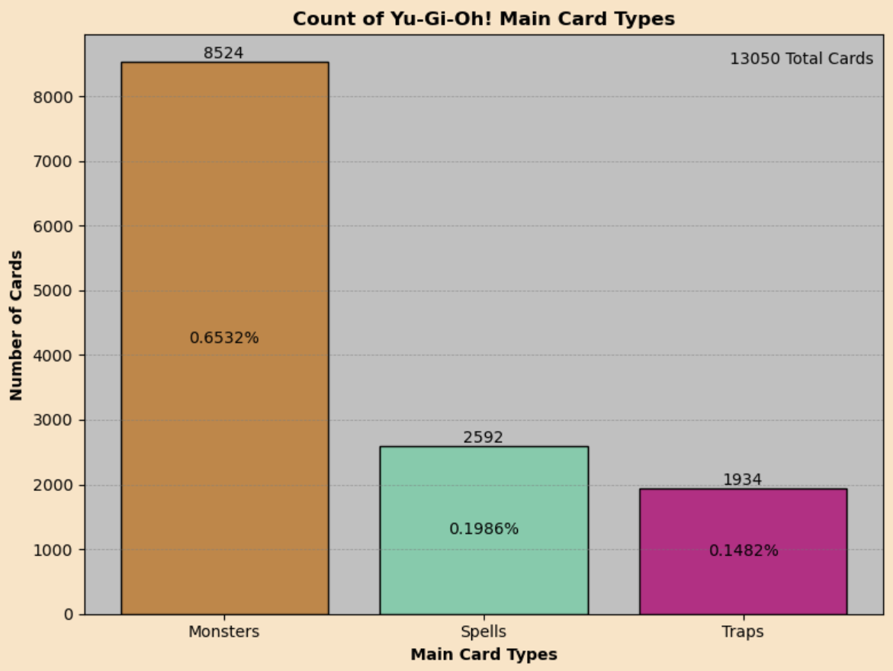
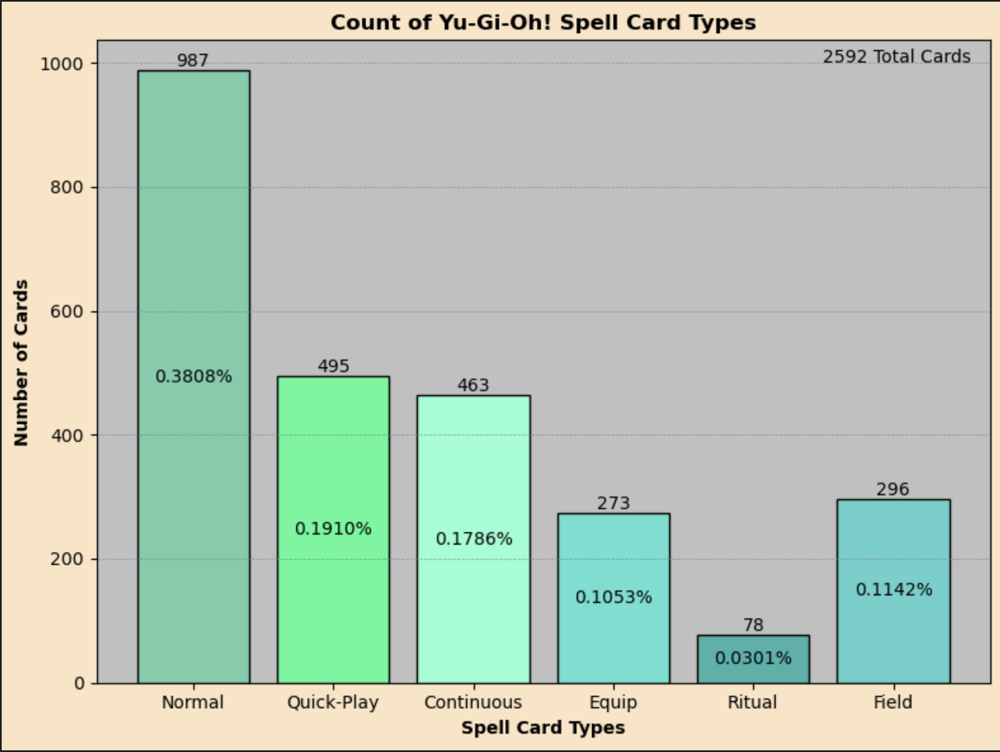

# Yu-Gi-Oh! Cards Dataset

# Table of Contents

# Overview

Yu-Gi-Oh! is a Trading Card Game where players construct a Main Deck of 40 to 60 cards (Optional - Extra Deck: Up to 15 cards only (Fusion, Synchro, XyZ, and Link Monsters). Side Deck: Up to 15 cards to be swapped with either Main Deck or Extra Deck when playing a Best 2 out of 3). Decks are made up of Monster Cards, Spell Cards, and Trap Cards. Each card in the game is unique with its own artwork (some cards have alternate artworks), stats, and effects. The Objective of the game is to defeat the opponent. The most common way to do this is to reduce their life points to 0 (Both players begin the game with 8000).

This dataset included multiple files for also looking at card sets and card rarities but for my analysis I focused only on the actual cards themselves as that was what I was most interested in. I wanted to see the actual stats of how many of each kind of card are there in the game, their atk/def, type, level, etc. 

Basics of Yu-Gi-Oh!
- Players build a deck of 40 to 60 Main Deck cards, optional up to 15 Extra Deck cards, optional up to 15 Side Deck cards.
- 3 Main Card Types: Monster Cards, Spell Cards, Trap Cards.
- Players take turns performing actions such as summoning monsters, attacking, playing spells/traps.
- Players begin with 8000 life points and the most common way to win is to reduce the opponents to 0.
- You may also win the game if the opponent cannot draw a card at the start of their turn because they no longer have remaining cards in their main deck.
- Other Alternate Win Conditions do exist such as Exodia, the most well known one Alternate Win Condition.
- All Monster cards have a name, level/rank or link rating, ATK/DEF (Link Monsters are the exception with no DEF), attribute, type, effect.
- All Spell Cards have a name, effect, and Spell Type: Normal, Equip, Ritual, Continuous, Field, Quick-Play.
- All Trap Cards have a name, effect, and Trap type: Normal, Continuous, and Counter. Traps must be placed facedown before they can be played and cannot be played until the next turn.
- Most countries belong to the TCG while mostly asian countries belong to the OCG.
- Below is an image of the different card zones showing where each player places their cards in a game.

The Data Set I looked at was downloaded from Kaggle and is up to date with all cards in the game until about 7 months ago. This includes over 13,000 cards!

# Questions

- How many cards are there in the game?
- Of all the cards in the game, how many are: Monsters, Spells, Traps.
- Among the Monsters how many Main Deck types of monsters are there? Extra Deck monsters?
- How many types of Monsters and how many of each type are there?
- Of all the Monster Attributes, how many cards does each Attribute have?
- Average ATK/DEF of Monsters, Monster Types, Monster Attributes?
- How many of each Spell Card Type are there?
- How many of each Trap Card Type are there?
- What did the breakout of Limited and Banned cards look like?
- For every Monster Type and Attribute, how many cards are there?
- Out of all the cards in the game how many see most play?
- What cards are people the most interested in reading about?
- What cards are being upvoted and downvoted?

# Cleaning

For the most part this dataset seemed very good and complete and only had 1 value missing in a column out of over 13,000 rows. The dataset did have null values but that is because of the nature of the cards themselves. For example Link Monsters do not have a DEF stat so all of those cards had a null value. Another example would be all Spells and Traps had null values for ATK/DEF, level, etc. So this was just a matter of reorganizing the dataframe to account for the different card types. I did remove from the dataframe Skill Cards and Tokens. I removed Skill Cards because I wanted to focus on the TCG and not Speed Duel. I also removed Tokens because they are not real cards themselves and I was not interested in looking at them. However the Tokens included in this dataset are official Token cards from Konami.

# Analyzing the Data

The first thing I did was pull how many of each type of card there were

I converted all of the different Monster types to just Monsters so I could see the breakout of the 3 Main Deck Card Types. Almost 2/3rds of all the cards in the game are Monsters! Just a little under 20% of all cards are Spell Cards, and just under 15% of all cards are Trap Cards.

Looking at just the monsters, I divided them up into the different Monster Card Types.

- The amount of Effect Monsters in the game towers over the amount of all other Monster cards in the game. Normal Monsters make up about 8.31% of all monsters,
- Effect monsters make up about 67.89% of all monsters, Fusion Monsters make up about 5.75% of all monsters, Ritual Monsters make up about 1.55% of all monsters,
- Synchro monsters make up about 5.41% of all monsters, XyZ Monsters make up about 4.87% of all monsters, and Link monsters make up about 4.87% of all monsters.

- What is interesting to note is that Link Monsters are the newest Extra Deck mechanic to be introduced into the game (2017) and yet its total number of cards aren't that far behind Synchro Monsters (2008) and Fusion Monsters (2002). Normal Monsters, Effect Monsters, Fusion Monsters, and Ritual Monsters were all introduced in 2002. Despite Ritual Monsters being one of the oldest mechanics in the game it has the fewest amount of cards.

I divided all of the Monsters into their respective types. Coming into this I thought that the top 3 most represented types would be Dragon, Spellcaster, and Warrior because those are the types I hear players say receive the most support. 

Surprisingly there are a lot more Fiends and Machines than I was expecting with those types taking 2nd and 3rd place respectively.

I want to talk about some of the types with the fewest cards. 
- Creator-God and Divine-Beast. These 2 types are reserved for the Egyptian God cards from the Yu-Gi-Oh! anime and are somewhat special. These 2 types do not really have an impact on the game and the 1 Creator-God monster has not even been released in the TCG.
- The Illusion type is the newest type in the game releasing in 2023.
- The Wyrm type was introduced in 2014 while Cyberse was introduced in 2017. Despite this Cyberse has almost x3 times as many cards. I speculate this is because the main protagonist of the Yu-Gi-Oh! VRAINS anime used Cyberse cards. 
- The last type I want to comment on is Sea Serpent. This type was one of the original types introduced to Yu-Gi-Oh! yet the only types it has more cards than is the newest type in the game (Illusion) and the Special Creator-God and Divine-Beast types.

I divided the Monsters into their respective Attributes. Coming into this I expected DARK and LIGHT to have the most amount of cards because those are the Attributes that most players agree are the best in the game. What I found here is that DARK does have the most amount of cards but EARTH has the second most amount of cards. LIGHT has the 3rd highest. I think this might be because there are more EARTH monsters but the quality of those cards is lower than the LIGHT ones. Having more or less cards is not indicative of power so there must be other reasons for why people think LIGHT and DARK are the best attributes. 

WATER, WIND, and FIRE have about half the amount of cards each that LIGHT has which I thought was interesting. 

Lastly the 6 DIVINE attribute cards belong to the 5 Divine-Beast cards and 1 Creator-God card. 

I was curious how the average ATK and DEF looked for each monster type. So I calculated the overall average for ATK and DEF and the individual averages for each Monster Type.

- Dragon monsters have the highest average ATK stat followed by Wyrms (Funny because a Wyrm is a dragon-like creature with no limbs/wings, similar to a serpent).
- The third highest average ATK stat are Illusion monsters. I think this may be because they are the newest type introduced to the game, so Konami probably wanted them to have good stats to help them do well. 
- Dragons and Wyrms once again are at the top with the highest averages for DEF. Divine-Beast comes in 3rd with Illusion coming in 4th.
- While Dragon had the highest average ATK, Wyrms have the highest average DEF.
- Creator-God has the lowest average ATK and DEF, but it only has 1 card in that type which has ? ATK and ? DEF (? is treated as 0). 
- Rock is also the only type where average DEF is higher than average ATK.
- Divine-Beast and Creator-God each have their ATK/DEF with the same average.
- For the most part average ATK is higher than average DEF. 

Now I wanted to see the same thing but this time for Monster Attribute. 
- What I found was that LIGHT has the highest average ATK and FIRE with the second highest and DARK with the 3rd Highest. 
- DIVINE has the same average ATK/DEF.
- LIGHT has the highest average ATK/DEF while FIRE has the 2nd highest ATK on average but also the lowest DEF on average.
- Unlike the previous graph, here DEF is never higher than ATK on average.

I wanted to see if there was a relationship between Level/Rank and ATK/DEF. I predicted going into this that ATK/DEF would increase as Level/Rank increased.

Here is what I found:
- With the exception of Levels/Ranks 0 & 13, ATK/DEF did increase as Level/Rank increased.
- Levels/Ranks 0 & 13 are special cases however because Level/Rank 0 has just 6 cards and Level/Rank 13 has 2 cards.
- Levels/Ranks 1 & 2 had higher average DEF stats but every other level besides 0 & 13 had higher average ATK than DEF.
- Levels/Ranks 11 & 12 have very close average ATK and DEF but Levels/Ranks 12 do still have higher averages.
- Level/Rank 3 appears like they have the same average ATK and DEF but ATK is just a tiny bit higher. 959.3 ATK vs 951.5 DEF.

I wanted to check if this trend was also true with Link Monsters as they do not have a Level or Rank but instead a Link Rating. 

What I found was that Link Rating still holds to this trend. The only exception was Link 6 Monsters which only have 2 cards.

Link 5 Monsters also have a higher average ATK than a Level/Rank 12 monster.

I wanted to check the composition of all the Spell cards in the game.

What I found was:
- Normal Spells were the most common.
- Ritual Spells have the fewest amount of cards. This lines up with Ritual Monsters having the fewest amount of Monsters. Ritual Spells are for bringing out Ritual Monsters. They depend on each other to be useful. 

I wanted to check the composition of all the Trap cards in the game.

What I found was:
- Normal Trap cards make up almost 2/3rds of all the Traps in the game.
- Continuous Traps were the next most common with about 27% of the Trap Card pool.
- Lastly Counter Traps were the least common with a little over 8% of the Trap Card pool.

I was curious about the power of the different cards so that led me to look at the Forbidden/Limited list. First we will look at Limited cards.

A card that is Limited means only 1 copy of that card is allowed in a decklist. Forbidden or Banned means that card is not allowed to be used in your decklist.

The breakdown of the Limited cards appears similar to how the breakdown looked of all the cards in the game.

- The majority of cards that are Limited are Effect Monsters and Spell Cards. 
- The only Normal Monsters that exist anywhere on the Limited/Forbidden list belong to Exodia. The Exodia cards are here not because the individual cards themselves are good, but to nerf the Exodia win condition which requires all 5 Exodia pieces to be in your hand.
- Ritual Monsters are not included here showing the power of those cards to be very low. 

I wanted to see if there were any common types that have Limited cards. This graph shows the power of Dragons and Spellcasters. They were several types not included which shows those types tend to be weaker in power.

# Credits

- The logo was downloaded from the official yugioh website https://www.yugioh-card.com/en/
- The image of the field was taken from wholesalemall at this link https://wholesalemall.ru/product/126177194207
